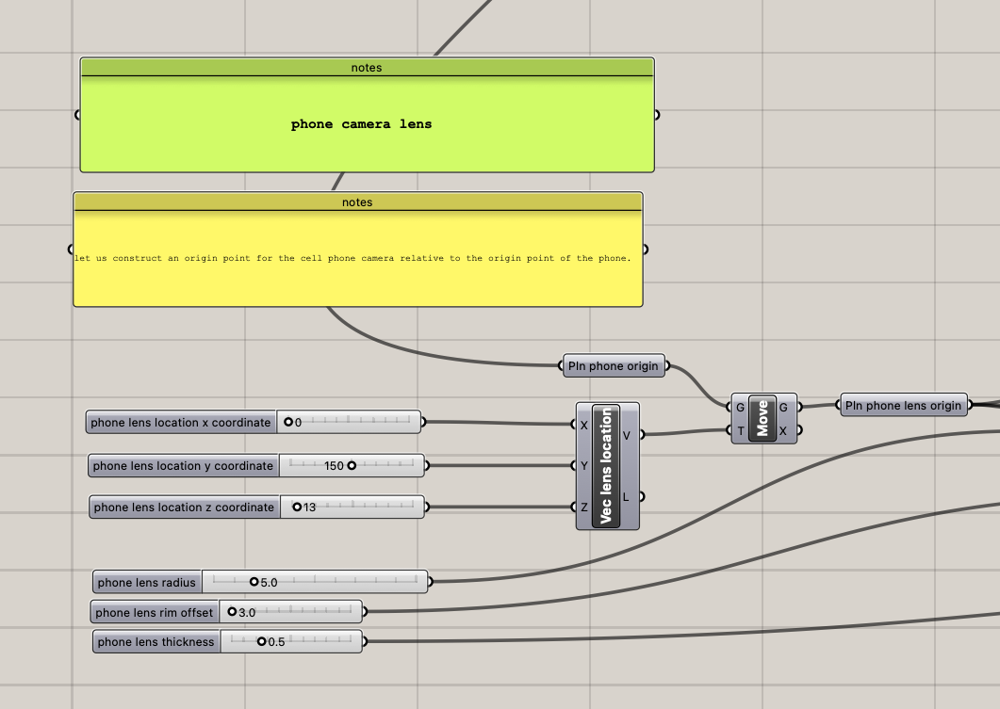
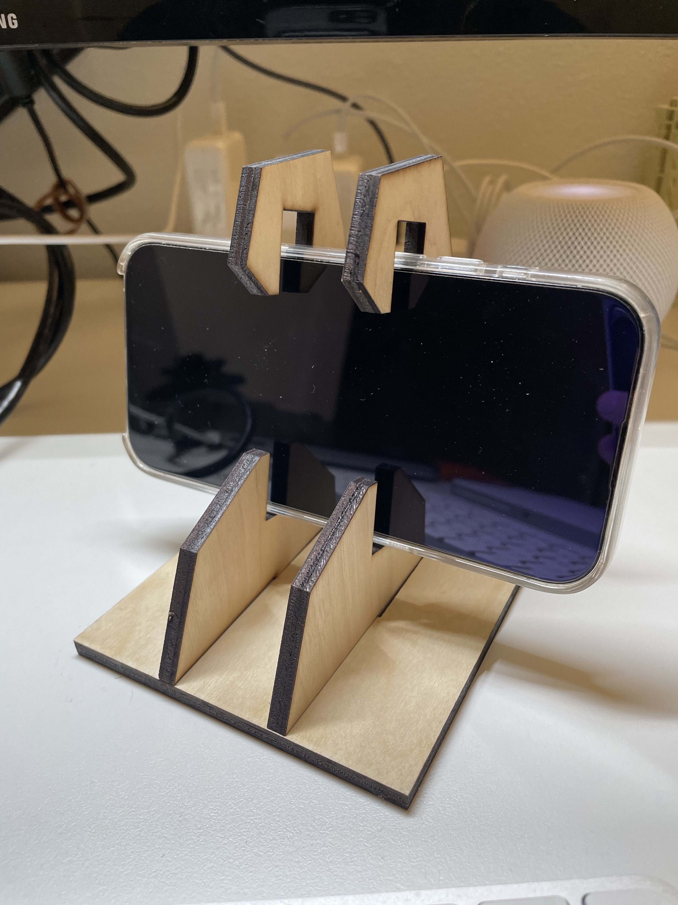
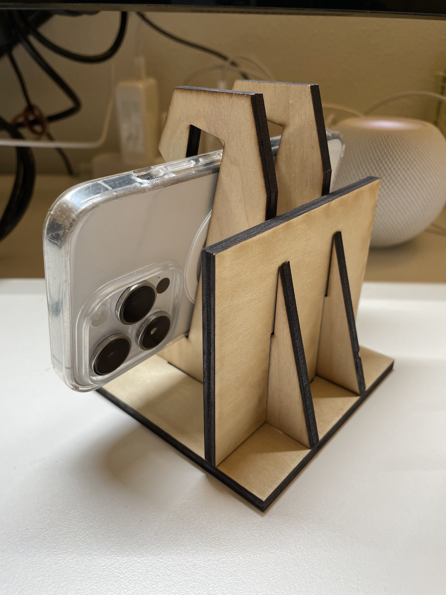

# Week 1 Report - Week of 08/31/2023
## Technology Design Foundations  

### Intro & summary

This week, I explored Rhino and Grasshopper to make a little change on the existing phone stand design. I also laser cutted the tweaked version of the phone stand.
The progress photos from this week are shown below! 

### Progress description

I first measured my phone's dimension (with my phone case on), since my case is a pretty standard one, it doesn't require much changing in width and thickness.
So my tweaked design's dimensions are:

width: 76mm
length: 165mm
thickness: 11mm

Then I input all those data into the Grasshopper file

I picked 1/4" plywood as material since it's cheap (🫢) and five people shared one board!

Here's how it looks!

Work on your weekly Progress Report
please include images of attempts to tweak file, & images of laser cut objects (if you are successful)
reflect on the experience of exploring a procedural model whose output is a cell phone stand design in Rhino
Consider: What other contextual observations would be useful to capture?
Consider: What other evaluations of results would be useful to provide as feedback?
Consider: Are there points in the process where you think AI…
Could be used to assist?
Could be trained on input and output?
Other?

---

or, if you prefer, you can create separate files and link to them here, like so:

---
[Example Report 1](weekly-reports/example-report-1.md)
---

Either way, it's time to start making this space your own! If you want to save these instructions -- Don't worry, I already copied them over to another file for you [here.](welcomeREADME.md) So feel empowered to delete everything in this README.md and start documenting! 

sparkles,

your TDF TA, shm :sparkles:

PS: let me know if you have any questions!!

--- 
PPS: 
## Quick Links, compiled here for your convenience: ##

- [TDF Wiki](https://github.com/Berkeley-MDes/desinv-202/wiki) - the ultimate source for truth and information about the course and assignments
- [Google Drive Folder](https://drive.google.com/drive/folders/1OjFgu4llHn-2WayQFVWRKFyOkQ_WaQRx?usp=drive_link) - slides and other resources
- [bCourses](https://bcourses.berkeley.edu/courses/1528355) - where the grading happens

