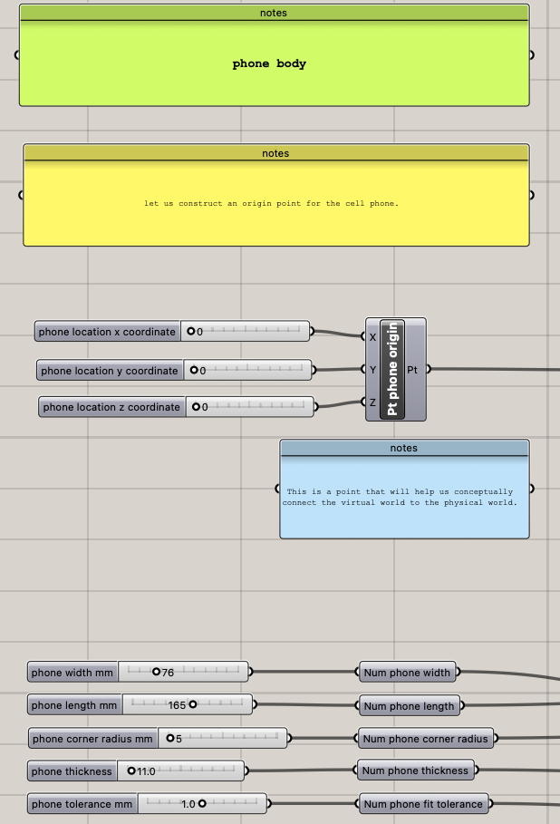

# Week 1 Report - Week of 08/31/2023
## Technology Design Foundations  

### Intro & summary

This week, I explored Rhino and Grasshopper to make a little change on the existing phone stand design. I also laser cutted the tweaked version of the phone stand.
The progress photos from this week are shown below!     

### Progress description

I first measured my phone's dimension (with my phone case on), since my case is a pretty standard one, it doesn't require much changing in width and thickness.
So my tweaked design's dimensions are:

width: 76mm  
length: 165mm  
thickness: 11mm  

  
Then I input all those data into the Grasshopper file

After baking and export the file into AI, I just followed the instructions to change the color and path thickness in AI. Then for laser cutting, I picked 1/4" plywood as material since it's cheap (🫢) and five people shared one board!

Here's how it looks!

### Reflection

This is my first time using Grasshopper and even I used Rhino (a little bit) before, the whole process seems quite overwhelming to me 🫨
The flow map in Grasshopper is massive and I only got to explore the few parameters that I am sure of.

However, I do believe this procedural model can be really powerful when we are trying to model a CAD in the context of many external factors. Instead of tweaking the specific dimensions manually in the CAD, this method helps a lot to save time for iterations under different scenarios. Moreover, its 'adaptive' function and Rhino's way of showing everything together definitely makes the connection of every factors more visually intuitive to understand.

Some of my considerations:

1. What other contextual observations would be useful to capture?  

  

It can be the distance and angle between the center of the screen to the focus point of the user's view. Also maybe the estimated using time since longer using time may cause posture change of user. It can also relates to the height of the user's chair (or the height extending from the table depending on user's height)

2. What other evaluations of results would be useful to provide as feedback?  

It can be subjective like how fatigue the user feels after using the setup.

3. Are there points in the process where you think AI…
   Could be used to assist? & Could be trained on input and output?  

   
   AI can definitely be combined with this process to make the iterative progress more smart. A direct feedback loop can be set up and AI can iterate within the range till it hits the 'sweet spot' range set up by the user. It can be further trained to suggest a more reasonable input and therefore generate a more accurate output.

# Week 2 Report - Week of 09/07/2023
## Technology Design Foundations  

### Intro & summary

This week, I mainly focused on getting to know Rhino (and enjoyed the Labour Day weekend😁!). I watched some tutorials on Rhino on basic funcstions, and managed to design something (a hair dryer holder) with it. I also thought about the possible changes for the existing phone holder design to make it more user friendly.

### Progress description  

##### About Rhino  

Although I've done CAD before, but the logic of CADing in Solidworks and OnShape is a lot different than the one Rhino uses. So I took some time and firstly watched some tutorials to get to know Rhino.   

I firsly went through some basic tutorial videos on both Rhino's websites and YouTube, then tried to make something myself without following the tutorial (will be explained in the next section!).   

After getting to know Rhino a little, I realise that instead of making a 2D sketch than extrude it, Rhino uses points to make lines, lines to make planes, and planes to make volume. I guess this logic gives Rhino more freedom when designing complicated shapes with many curves. Because based on my previous experiences with Solidworks/OnShape, it is ok to do regular shape modelling, but quite difficult and inconvinient to do fancy curvy shapes. I hope in the future when comes to designing something really curvy and complicated in shape, I can explore those fancy features in Rhino!

##### About the hair dryer holder  

Since I want to do something completely myself, my plan is to make something new through Rhino and 3D print it out later. What comes into my mind is a hair dryer holder since I kinda need it and don't wanna spend about 20 bucks on Amazon just to buy a simple holder...🤷🏻‍♀️ 

